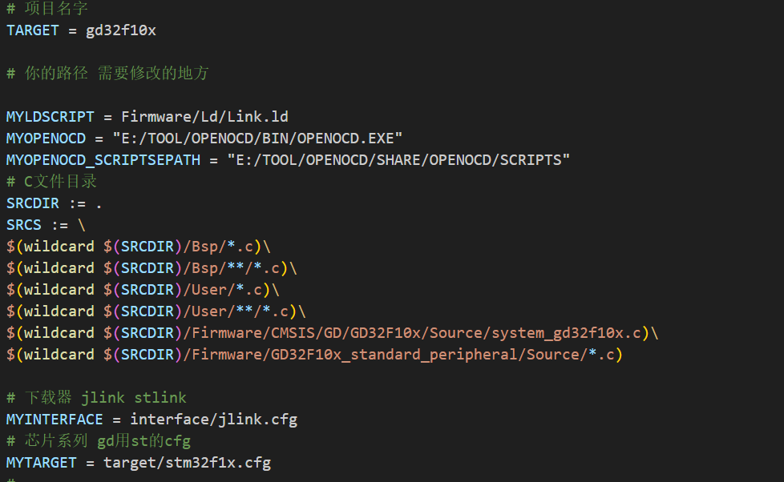

# 借鉴于
[https://github.com/cjacker/gd32f10x_firmware_library_gcc_makefile](https://github.com/cjacker/gd32f10x_firmware_library_gcc_makefile)

For more information about how to use this library, refer to [this tutorial](https://github.com/cjacker/opensource-toolchain-stm32).

# gd32f10x firmware library with gcc and makefile support

[软件包地址要更新自己搜索一下便是了](https://www.gd32mcu.com/cn/download?kw=GD32F10x&lan=cn)

GD32F10x系列和 F30x系列有MD(中容量) 、HD(大容量)、XD（超大容量）、 CL（互联型） 等系列，
不同的系列外设资源略有差异，所以在使用官方的固件库(Firmware)时也要作相应的选择和定义；
中密度产品：闪存存储器容量16K到128K字节之间的产品；
高密度产品：闪存存储器容量256K到512K字节之间的产品；
超高密度产品：闪存存储器容量大于512K字节的产品；
互联型产品：GD32F105xx和GD32F107xx微控制器产品；

This firmware library support gd32f103/105/107 parts from GigaDevice:

To build the project, type `make`.

# to support other parts
To support other GD32F10x parts, you need:
要支持 gdf10x 系列的话：

- change 'Firmware/Ld/Link.ld', set FLASH and RAM size according to your MCU.
- 根据你的芯片来修改  'Firmware/Ld/Link.ld' 文件 里面的  FLASH and RAM 的值
- 不知道这个FLASH and RAM 的值就去这个网站搜一下芯片就有了  [https://www.szlcsc.com/](https://www.szlcsc.com/)
- choose correct startup asm file and change the 'ASM_SOURCES' in 'Makefile'
- 修改启动文件在makefile里面
  + Firmware/CMSIS/GD/GD32F10x/Source/GCC/startup_gd32f10x_cl.S : for 105 and 107
  + Firmware/CMSIS/GD/GD32F10x/Source/GCC/startup_gd32f10x_hd.S : for flash size range from 256K to 512K
  + Firmware/CMSIS/GD/GD32F10x/Source/GCC/startup_gd32f10x_md.S : for flash size range from 16K to 128K 
  + Firmware/CMSIS/GD/GD32F10x/Source/GCC/startup_gd32f10x_xd.S : for flash size > 512K
- change `-DGD32F10X_MD` C_DEFS in 'Makefile' to `MD`, `HD`, `XD` or `CL` according to your MCU.
- change `-DGD32F10X_MD` C_DEFS in 'Makefile' to `MD`, `HD`, `XD` or `CL` according to your MCU.
- 把 C_DEFS 的 `-DGD32F10X_MD` 根据你的芯片改成 `-DGD32F10X_HD` ,`-DGD32F10X_XD` ,`-DGD32F10X_CL`.
- change the 'TARGET' in 'Makefile'
- 我把这些需要修改的地方全部给再定义一遍如下 

#### 文档还在持续优化中........

